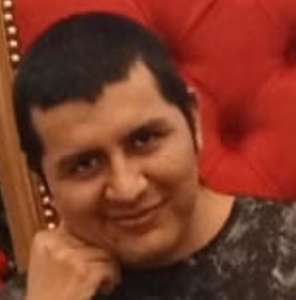

# Progra-2
Grupo Abstractos
# Presentación integrantes

Dante Borgoglio

Objetivo: aprender, entender y poder dominar los conceptos de la materia. 

Expectativa: que la cursada sea fluida y entretenida.

Massimo Trovato - 20 años

Objetivo: aprender nuevos conocimientos que considero importantes para desarrollarme en el ámbito IT.

Expectativa: Que logre adquirir los conceptos de la materia.

Alejandro Yandé

Objetivos: Aprender todos los conceptos importantes de la materia para poder implementarlos en mi carrera.

Gustos: Me gusta mirar peliculas los fines de semana, entrenar, Jugar con mis mascotas y Jugar videojuegos.

Expectativas: Aprender nuevos lenguajes de programacion.

Mia colombo

Objetivos: Reforzar mis conocimientos y aprender a aplicarlos en proyectos reales

Expectativas: Incorporar nuevas herramientas y ganar experiencia.

Andrés Ortuño
Objetivos: Aprender y dominar el lenguaje de programación para usarlo en mi vida diaria 

Gustos: me gusta jugar videojuegos como también aprendo a dibujar

Expectativas: es que este proyecto me ayude a mejorar como a tener nuevas experiencias

